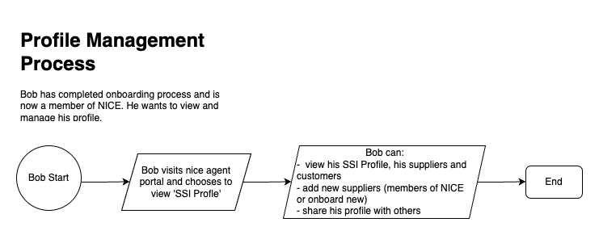

# NICE Agent Portal

This repository contains the code for the front-end portal to the NICE (Network Insight Collaboration Environment) configuration of Veritable.

## Description

The [Network Insight Collaboration Environment](https://digitalsupplychainhub.uk/showcase/critical-minerals-flagship/) aims to demonstrate that an innovative approach, based on new and existing technology, will allow supply chains to share insights and data across multiple data platforms, enhancing the efficiency of the supply chain network. It forms part of Critical Minerals, one of the flagships of the Digital Supply Chain Hub run by Made Smarter Innovation.

### Usage

#### Prerequisites

- docker 19.03.0+
- docker-compose v2.23.0+
- npm 10.0.0+
- node 20.0.0+

#### Single Agent

To run a full Peer agent stack, use:

```
npm run compose:up:agent
```

Once running, the agent frontend is available at http://localhost:3000 and the API is available at http://localhost:3000/api/docs

Configuration options are set using environment variables defined in a `.env` file in the project root.

#### Multiple Agents

To run more than one agent at a time, docker compose project names must be set, and configuration options for each agent defined through `.env.${PROJECT_NAME}` files at the project root.

As an example, configuration options have been defined in this repository for the following 3 agents:

- `nice-agent-alice`: a Peer node
- `nice-agent-bob`: a second Peer node
- `nice-agent-issuer`: an Issuer node

These 3 agents can be run with the following command: `npm run compose:up`

With the default configurations defined in this repo's `.env.*` files, the portals will be available at:

- Peer 1 (Alice): http://localhost:3000
- Peer 2 (Bob): http://localhost:3001
- Issuer: http://localhost:3002

**Note:** Although many Peer nodes can be run simultaneously, only a single Issuer node can be run at a time.

#### Development Mode

To build the agent, use the following command at the project root:

```
npm run build
```

To run the agent in development mode, first bring up dependencies with:

```
npm run compose:up:deps
```

In a different shell, run either the Peer or Issuer with the following commands.

Peer agent:

```
npm run dev:peer
```

Issuer agent:

```
npm run dev:issuer
```

#### Development Mode with Multiple Agents

To run an agent in development mode against other agents, the steps are:

- If running the issuer in development mode, define its hostname and port as env vars
- Set up all non-development agents in production mode using `npm run compose:up:<agent-name>`
- Set up the dependencies of the agent to be run in development mode, loading the development environment variables using `npm run compose:up:deps:<agent-name>`
- Start the target agent in develpoment mode with the required environment variables loaded using `npm run dev:<agent-name>`

For example, to work on the issuer node in development mode, run the following commands:

```
(export ISSUER_HOST=host.docker.internal ISSUER_PORT=3002 &&
 npm run compose:up:agent:alice &&
 npm run compose:up:agent:bob &&
 npm run compose:up:deps:dev:issuer &&
 npm run dev:issuer)
```

Or, for another example, to work on peer alice in development mode, run the following commands:

```
npm run compose:up:agent:bob
npm run compose:up:agent:issuer
npm run compose:up:deps:dev:alice
npm run dev:alice
```

Or, for another example, to work on peer bob in development mode, run the following commands:

```
npm run compose:up:agent:alice
npm run compose:up:agent:issuer
npm run compose:up:deps:dev:bob
npm run dev:bob
```

#### Terminating a cluster

To bring down the entire cluster, use the command
```
npm run compose:down
```

And to reset the state of the cluster (**warning**: this will delete **all** data) use the command
```
npm run compose:down:clean
```

#### Testing

### Unit tests

To run unit test suites use the command `npm run test:unit`

### Integration testing

To run integration test suites, dependencies must be brought up in test mode using
```
npm run compose:up:deps:test
```

This will start the dependencies up in a clean ephemeral state. Now tests can be run for using
```
npm run test:integration
```

### End-to-end testing

To run E2E tests a full cluster of 2 peers and an issuer must be set up in test mode using
```
npm run compose:up:test
```
This will start the cluster in a clean ephemeral state. Tests can now be run using

```
npm run test:e2e:wait4peers
```
(this script waits until the IPFS nodes have successfully formed a swarm before beginning tests).

**Note:** If successful, the E2E tests will clean up any resources they create. If the tests fail, howevere, the cluster could be left in a dirty state, and so `npm run compose:up:test` should be run again before tests are re-run.

### Architecture

The NICE Agent is built on top of the Veritable agent, and this repo describes the portal that allows the Veritable agent to be utilized. The following diagram shows the entire architecture, although the NICE Agent will include different components depending on role (Issuer vs Peer).


Below is the specific architecture for an Issuer node. Note that an Issuer node does not have a NICE frontend, it will be administered through a separate system. Also note that the ipfs-cluster component is included here - this allows for ensuring data stored to IPFS remains available should any particular node go down.


Below is the specific architecture for a Peer node (NICE participant, Supplier or Consumer). Note that nice-agent-portal (the react frontend and backend) acts as the gateway to the Veritable system. Also note that ipfs-cluster should not be required here, as each node is independently responsible for its own stored IPFS data being available.


### NICE Onboarding Processes

The onboarding process for NICE allows users to enroll as members, verify their credentials, and add elements of their supply chain. There are 4 processes documented:

1. **Application**: In this process, a prospective member has initialized their node through owned or shared infrastructure, and submits their identifying data to NICE for verification.
   

2. **Confirmation**: In this process, a prospective member's identity has been confirmed by NICE and they have been given the cryptograhic material required to create a credential through an Issuer node.
   

3. **Profile Management**: In this process, a fully-onboarded member is able to review their identity details, as well as adding elements to their immediate supply chain (consumers and/or suppliers).
   

4. **Chained Onboarding**: In this process, a fully-onboarded member is able to invite elements of their supply chain to NICE, and verify them once these participants are onboarded.


## Repo structure

This repo contains a React frontend in the `/frontend` directory and a TSOA backend in the `/backend` directory.

## License

This project is licensed under the **Apache 2.0** license.
