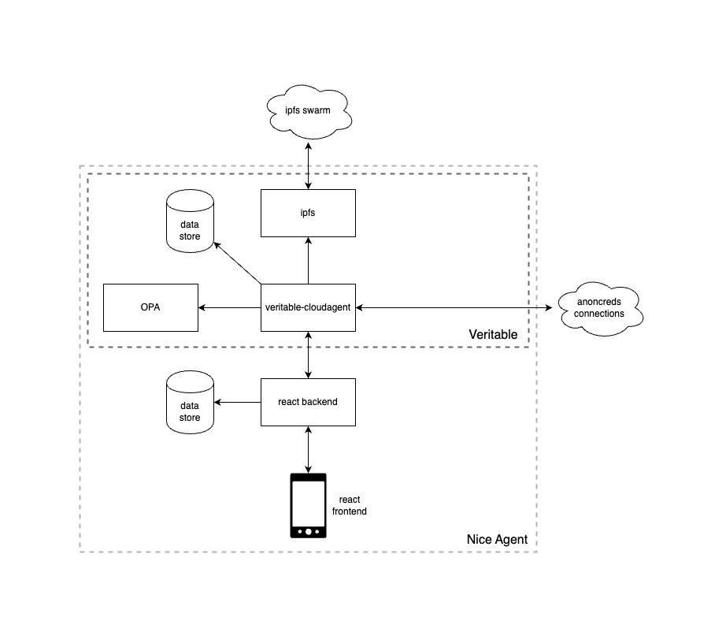
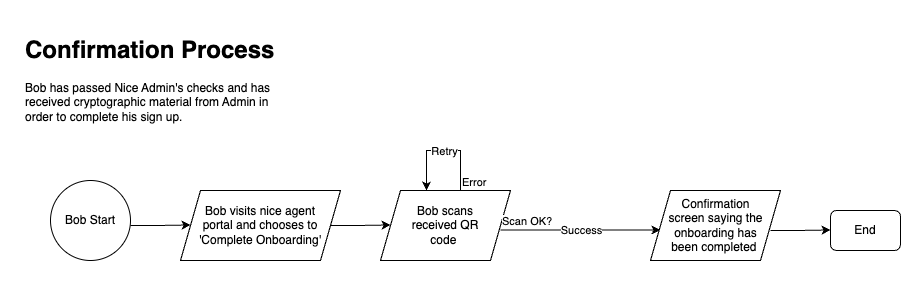

# NICE Agent Portal

This repository contains the code for the front-end portal to the NICE (Network Insight Collaboration Environment) configuration of Veritable.

## Description

The [Network Insight Collaboration Environment](https://digitalsupplychainhub.uk/showcase/critical-minerals-flagship/) aims to demonstrate that an innovative approach, based on new and existing technology, will allow supply chains to share insights and data across multiple data platforms, enhancing the efficiency of the supply chain network. It forms part of Critical Minerals, one of the flagships of the Digital Supply Chain Hub run by Made Smarter Innovation.

### Usage

To run the full stack, use:
```
docker-compose up --build
```

Environment variables can be set using a `.env` file in the project root (see example file [`.env.example`](./.env.example))

### Architecture

The NICE Agent is built on top of the Veritable agent, and this repo describes the portal that allows the Veritable agent to be utilized. The following diagram shows the entire architecture, although the NICE Agent will include different components depending on role (Issuer vs Peer).


Below is the specific architecture for an Issuer node. Note that an Issuer node does not have a NICE frontend, it will be administered through a separate system. Also note that the ipfs-cluster component is included here - this allows for ensuring data stored to IPFS remains available should any particular node go down.


Below is the specific architecture for a Peer node (NICE participant, Supplier or Consumer). Note that nice-agent-portal (the react frontend and backend) acts as the gateway to the Veritable system. Also note that ipfs-cluster should not be required here, as each node is independantly responsible for its own stored IPFS data being available.



### NICE Onboarding Processes

The onboarding process for NICE allows users to enroll as members, verify their credentials, and add elements of their supply chain. There are 4 processes documented:

1. **Application**: In this process, a prospective member has initialized their node through owned or shared infrastructure, and submits their identifying data to NICE for verification.
   

2. **Confirmation**: In this process, a prospective member's identity has been confirmed by NICE and they have been given the cryptograhic material required to create a credential through an Issuer node.
   

3. **Profile Management**: In this process, a fully-onboarded member is able to review their identity details, as well as adding elements to their immediate supply chain (consumers and/or suppliers).
   

4. **Chained Onboarding**: In this process, a fully-onboarded member is able to invite elements of their supply chain to NICE, and verify them once these participants are onboarded.


## Repo structure

This repo contains a React frontend in the `/frontend` directory and a TSOA backend in the `/backend` directory.

Bring up dependences with

```
docker compose up veritable-agent ipfs opa -d
```

Build both frontend and backend:

```
npm run build
```

Build the frontend and run the backend with nodemon:

```
npm run dev
```

View OpenAPI documentation for all routes with Swagger:

```
localhost:3000/api/docs
```

View frontend:

```
localhost:3000
```

Run tests

```
npm run test
```

## License

This project is licensed under the **Apache 2.0** license.
